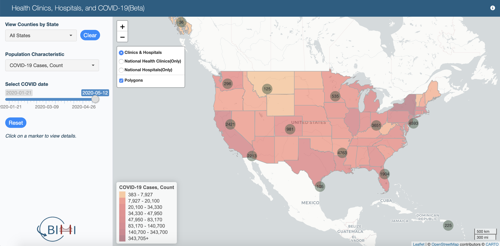
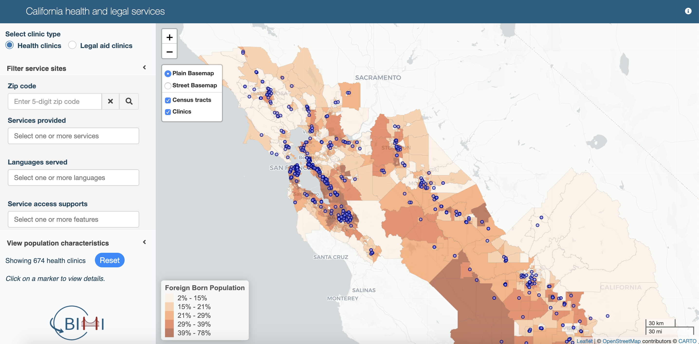
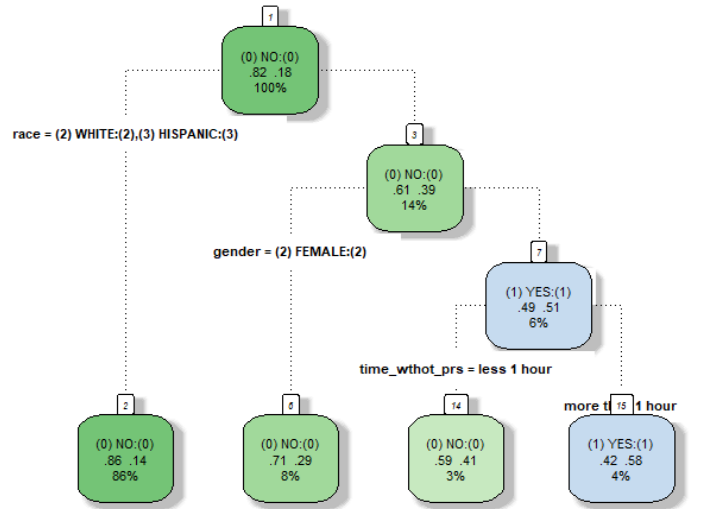
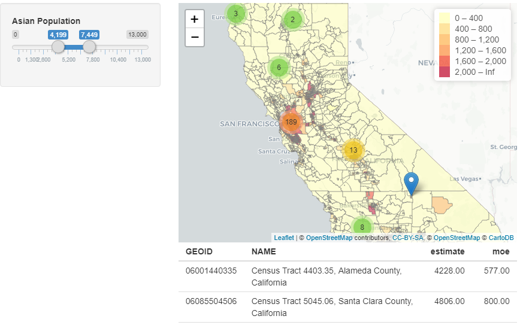

Here are some projects that I have got involved in. It varies from research design to data analysis, and visualization. Although topics in these projects may different, the core idea is that applying computional skills for social goods. Meanwhile, in most situations, these skills and menthods can be transferred to new fields easily.

## How Nonprofits React to Economic Downturn Recession? [[pdf version](SSWR.pdf)]

## Health Clinics, Hospitals, and COVID-19 [[Link](https://shiny.demog.berkeley.edu/bimi/immigrantsatrisk_covid19map)]

## California Health and Legal Services [[Link](https://shiny.demog.berkeley.edu/bimi/CENSUS/)]

## Nonprofit Longevity Analysis [[Abstract](https://sswr.confex.com/sswr/2020/webprogram/Paper38964.html)], [[pdf version](Trends in Non-Profit Sectors.pdf)]

## Social Support and Students' Suspension [[Abstract](projects2.md)]

## Asian Nonprofits in CA [[Github](https://github.com/chengren/Asian-Pacific-Orgainzaitions-in-CA)]

